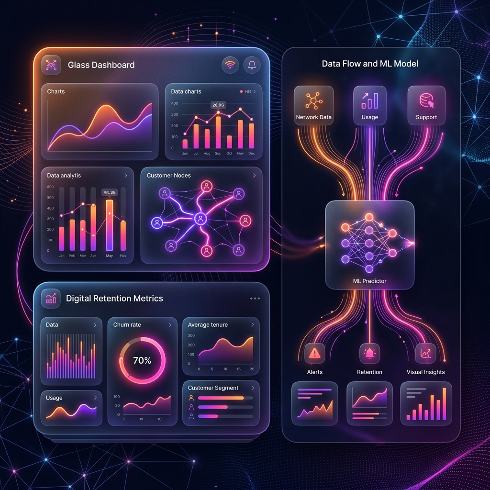

<div align="center">

# 📊 Telco Customer Churn Prediction
**End-to-End Machine Learning Pipeline for Customer Retention**



[](https://python.org)
[](https://scikit-learn.org)
[](https://xgboost.readthedocs.io)
[](https://jupyter.org)
[](LICENSE)

</div>

---

## 🚀 Overview

Customer churn is one of the most critical business challenges for telecommunication companies—retaining existing customers is significantly cheaper than acquiring new ones. This end-to-end project builds a high-performance machine learning pipeline to identify customers who are statistically likely to churn, enabling proactive and targeted retention strategies.

**This repository covers the complete Data Science lifecycle:**
`Data Cleaning` ➔ `Exploratory Data Analysis (EDA)` ➔ `Feature Engineering` ➔ `Model Training` ➔ `Hyperparameter Tuning` ➔ `Business Insights`

---

## 🏆 Key Achievements

<div align="center">

| Metric / Finding | Recorded Value | Winning Algorithm |
| :--- | :--- | :--- |
| **Peak Accuracy** | **~81%** | XGBoost Classification |
| **Highest AUC-ROC** | **~86%** | XGBoost Classification |
| **Strongest Predictor** | *Contract Type* | Feature Importance Analysis |
| **Highest Risk Cohort** | *Fiber Optic / Electronic Check* | EDA Clustering |

</div>

---

## 📂 Dataset Profile

**Source:** IBM Telco Customer Churn Dataset — **7,043** customers, **21** distinctive features.

| Feature Classification | Included Data Attributes |
|:---|:---|
| **Demographics** | Gender, Senior Citizen Status, Partner, Dependents |
| **Account Info** | Tenure, Contract Type, Paperless Billing, Payment Method |
| **Services Provided** | Phone Service, Internet (DSL/Fiber), Streaming TV/Movies, Tech Support |
| **Financial Charges** | Monthly Charges, Total Charges |
| 🎯 **Target Variable** | **`Churn` (Yes / No)** |

---

## 🧠 Machine Learning Models & Benchmarks

The dataset was rigorously preprocessed (missing value imputation, standard scaling, and one-hot encoding) prior to an 80/20 train-test split to prevent leakage. Three core models were benchmarked:

| Algorithm | Accuracy | Precision | Recall | F1-Score | AUC-ROC |
|:---|:---:|:---:|:---:|:---:|:---:|
| **XGBoost** | **~81%** | **~68%** | **~58%** | **~63%** | **~86%** |
| Logistic Regression | ~80% | ~67% | ~56% | ~61% | ~84% |
| Random Forest | ~79% | ~65% | ~48% | ~55% | ~83% |

> **Conclusion:** Extreme Gradient Boosting (`XGBoost`) achieved the most balanced performance characteristics, delivering the highest geometric mean between Precision and Recall.

---

## 📈 Strategic Business Insights

By deeply analyzing the XGBoost feature importance limits and EDA correlations, we extracted the following actionable intelligence for the Telco business unit:

1. **Contract Dynamics:** `Month-to-month` contract types are the single strongest predictor of churn. Locking customers into 1-year boundaries drastically increases LTV (Life-Time Value).
2. **Tenure Stability:** Churn probability is extremely high in the first 6 months but falls logarithmically as `Tenure` increases.
3. **Service Friction:** `Fiber optic` users experience unexpectedly high churn rates compared to `DSL`, indicating potential infrastructure or pricing dissatisfaction.
4. **Payment Friction:** Customers utilizing `Electronic Check` billing churn at a significantly elevated rate compared to those on automatic payments.

---

## ⚙️ Local Development

To run the complete data analysis and pipeline notebook locally:

```bash
# Clone the repository
git clone https://github.com/GhariebML/Telco_Churn_Prediction.git
cd Telco_Churn_Prediction

# Launch the Jupyter Notebook environment
jupyter notebook
```
*Open the main `.ipynb` notebook file to execute the pipeline cell-by-cell.*

---

## 👤 Author

<div align="center">

**Mohamed Gharieb** — *Data Scientist & ML Engineer*

[](https://github.com/GhariebML)
[](https://linkedin.com/in/ghariebml)

</div>

---
<div align="center">
  <sub>MIT License — Copyright (c) 2026 Mohamed Gharieb</sub>
</div>
